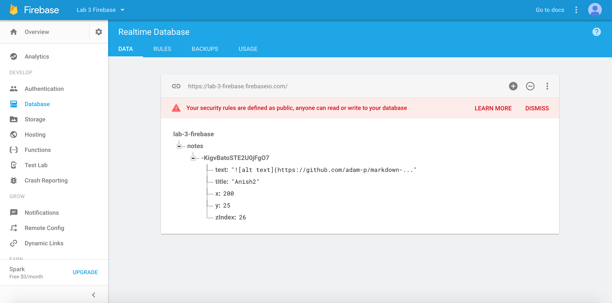

Anish Chadalavada  
Computer Science 52  
Lab Assignment 3: React Notes  
April, 26, 2017

In this lab, I used the React framework in order to design a page that utilized a component model and React data flows in order to allow for live note editing. I used Firebase to create a live backend that persisted all changes in real time.

The firebase part was quite difficult for me to get correct. I utilized a generalized Update function for changes to Note objects, and it proved quite difficult to connect this Update function to a backend database, particularly with regard to persisting changes in position.

Below is an example of my live webpage with a single note that contains the github logo, embedded via the markdown functionality.

Below is a picture of my what my Firebase looks like with that note: the Firebase is updated in real time. Updates include text and position, as well as addition and deletion of notes.

I owe a lot to Tim, as well as all the TAs that helped me, including Jon, Ahsan, and Alma. I made it to every office hours and help hours for this lab assignment and they helped me tremendously in completing the project as well as understanding the logic of React at a better level. I chatted with Dami Apoeso about this lab at a high level as well.

Citations (contained inline as well):
http://stackoverflow.com/questions/4689481/html-css-have-border-wrap-around-text  
http://stackoverflow.com/questions/9355677/keep-text-within-the-box  
https://andreypopp.github.io/react-textarea-autosize/  
https://css-tricks.com/snippets/css/a-guide-to-flexbox/
